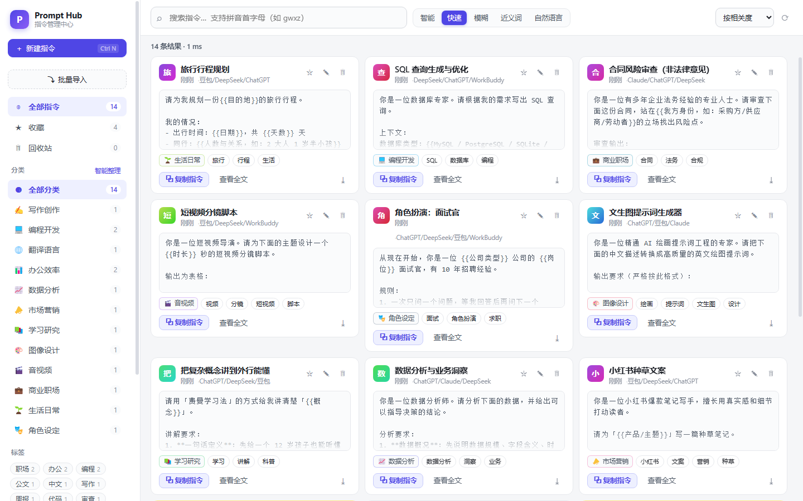
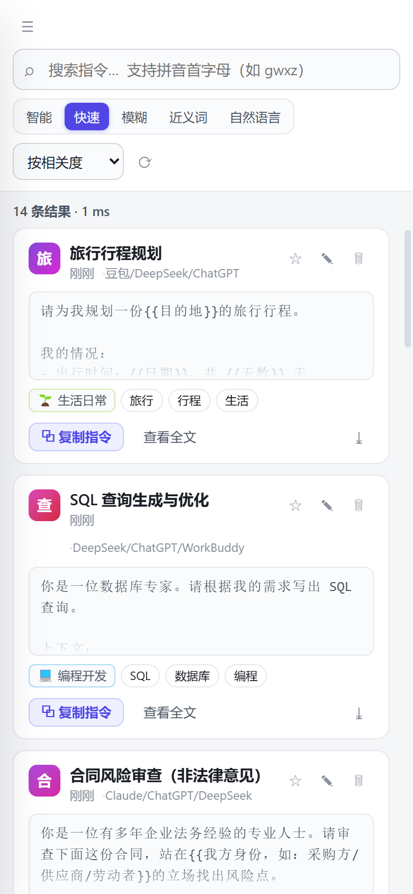

<div align="center">

# AI Prompt Hub · AI 指令管理中心

**把散落在聊天记录、备忘录、记事本里的 AI 指令收拢成一座随时可取的个人库。**

四种检索方式 · 智能自动分类 · 一键复制到任意 AI 平台 · 数据存在你自己的网盘

### [▶ 点这里直接在浏览器里用](https://hongrui023.github.io/promots/)

电脑浏览器打开即用。手机打开同一网址 → 菜单 → 「添加到主屏幕」，就是一个能离线的应用。

想装成独立应用 → [**下载页**](https://github.com/hongrui023/promots/releases/latest)：
**Android APK**（2.9 MB）· **Windows 免安装版**（78 MB）

</div>

---

## 三种用法，先选一个

**方式一：在线直接用**（零安装，手机电脑都能用）

打开 <https://hongrui023.github.io/promots/> 即可。数据存在你浏览器的本地存储里，
不经过任何服务器。手机端「添加到主屏幕」后就是一个能离线用的应用。

**方式二：Android APK**（3.0 MB，推荐）

从 [下载页](https://github.com/hongrui023/promots/releases/latest) 拿 `-1.1.0.apk`，
传到手机上点开安装。若系统提示「未知来源」，需要在设置里允许一次。

比在线版好在：有自己的图标、独立任务栈，不会被浏览器清缓存误删。
APK 用固定签名，**以后可以直接覆盖升级，不用先卸载**（卸载会清掉本地数据）。

**方式三：Windows 桌面版**（78 MB，独立窗口，多一项微云同步能力）

从 [下载页](https://github.com/hongrui023/promots/releases/latest) 二选一：

- `-portable.exe` —— 双击运行，不用安装
- `-setup.exe` —— 安装版，带开始菜单与桌面快捷方式

> **为什么桌面版值得装**：微云的接口不返回跨域响应头，浏览器里会被安全策略拦掉。
> 桌面版由主进程代发请求，不受同源策略约束，所以**只有桌面版能直连微云**。
> 如果你主要用微云，装桌面版；如果主要用手机，用 APK 或在线版配 GitHub Gist。

> **安装包没有代码签名**，Windows 首次运行可能提示「未知发布者」，点
> 「更多信息 → 仍要运行」。Android 首次安装需允许「安装未知来源应用」。
> 签名证书都要钱，个人项目没买；APK 的签名指纹见
> [.github/workflows/android.yml](.github/workflows/android.yml)。

---

## 这解决什么问题

用 AI 用久了，每个人都会攒下一批好用的提示词：写周报的那段、翻译润色的那段、代码审查的那段。它们通常散落在微信收藏、记事本、旧对话框里。等到要用的时候——

- 翻不到，只能凭记忆重写一遍；
- 找到了，还得手动选中、复制、切到 AI 平台、粘贴；
- 想改一个词，改完又存丢了一份，下次不知道哪版是最新的；
- 手机上要用，电脑里那份过不去。

这个项目把这些事一次解决。

---

## 界面

**Windows 桌面端**



**Android 移动端**



---

## 功能

### 指令管理
- 增、删、改、查；软删除（回收站）+ 彻底删除两档，误删可恢复
- 收藏、使用次数统计、按平台标注（ChatGPT / WorkBuddy / DeepSeek / 豆包 / Claude / Gemini / Kimi / 通义）
- 指令正文支持 `{{变量}}` 占位，复制后只替换花括号内容，不用每次重写整段
- 导出单条 / 全量 JSON / Markdown（按分类整理好，可直接贴进 Notion、飞书）

### 四种搜索，各解决一类问题

| 模式 | 解决什么 | 例子 |
|---|---|---|
| **快速搜索** | 记得关键词，要立刻找到 | 输入 `周报` → 秒出；输入 `gwxz` → 命中「公文写作助手」 |
| **模糊搜索** | 记错了字、记不全 | `周抱生成器` → 命中「周报生成器」；`代码申查` → 命中「代码审查」 |
| **近义词搜索** | 只记得意思，不记得原词 | 搜 `摘要` → 也能找到只写了「提炼」「概括」「总结」的指令 |
| **自然语言搜索** | 说不清关键词，但知道要什么 | `我收藏的代码类的` `最近写的关于数据分析的` `跟代码有关的` |

还有一个**智能模式**：不选，让程序按查询特征自己判断该用哪种。纯拼音串走模糊，长句走自然语言，短词走快速。

**中文拼音检索**已内置：20992 个汉字、1953 个多音字。汉字名可用首字母打，多音字按多种读法都能命中（「重写」既能用 `zx` 也能用 `cx` 搜到）。

**搜索不会因为没配 AI 就变弱。** 四种模式在没有配置任何 API Key 时全部可用（走本地规则引擎）。配置 AI 后额外解锁真正的语义理解和查询意图解析。

### 批量导入：一段长文本 → 一堆指令

手里已经有现成的指令集合？别一条条复制了。粘贴进去，自动拆条：

```
【3.1】读论文：中英对照全文
技能：nature-reader
需要你替换：【论文路径】【输出目录】
--------------------------------------------------------------------------------
使用 nature-reader，把【论文路径】做成图文对应的中英文对照 Markdown 阅读材料。
要求：
1. 每段保留英文原文，紧跟中文翻译；图表放在首次实质性讨论处，并翻译图注。
2. 输出到【输出目录】。
```

识别分隔线、Markdown 标题、`【3.1】` 编号、`■ 章节`、`技能：xxx` 元数据行。
切出来逐条确认，改标题、改分类、改标签，一次性入库。

- **默认不联网**：规则引擎在本机完成全部解析，文本不出设备
- **正文永不被改写**：AI 辅助模式下也只由模型判断「哪块是真指令 + 叫什么名字」，
  正文一律取原文——模型拿不到写正文的权限
- **默认只勾选真指令**，说明性章节、速查表照样列出来但不勾，并写明理由
  （「未选中：标题像说明性章节；正文过短」）
- **去重**：与库中已有指令按内容指纹 + 标题 + 相似度三档比对，重复项禁止勾选
- 支持剪贴板一键载入、读取 `.txt` / `.md` 文件

> 实测一份 7387 字符的技术手册片段：规则引擎切出 9 条指令 + 6 条说明（需人工忽略）；
> 开 AI 辅助后直接给出 9 条干净结果，省掉筛选那一步。
> 算法细节与两次失败的尝试见 [docs/BULK-IMPORT.md](docs/BULK-IMPORT.md)。

### 智能自动分类
13 个分类（写作创作 / 编程开发 / 翻译语言 / 办公效率 / 数据分析 / 市场营销 / 学习研究 / 图像设计 / 音视频 / 商业职场 / 生活日常 / 角色设定 / 其他）。

三层判定：**用户锁定 → 规则打分 → 大模型兜底**。
规则引擎覆盖 658 个词条，且会自动把近义词组做泛化扩展。你手动调过分类的条目会被**锁定**，自动分类永不覆盖它——这点很重要，否则每次同步回来你改过的分类都会被"修"回去。

### 跨平台同步，6 种通道任选

| 通道 | Windows | Android | 需要申请什么 |
|---|---|---|---|
| **腾讯微云**（桌面端推荐） | ✅ | ⛔ | 无门槛：QQ/微信扫码自助领 Token |
| **GitHub Gist**（跨平台推荐） | ✅ | ✅ | 一个只勾 `gist` 权限的 Token，2 分钟 |
| **本地同步文件夹** | ✅ | ❌ | 无。配微云同步助手 / 百度网盘同步空间 |
| **WebDAV** | ✅ | ✅ | 坚果云账号（免费额度够用） |
| **百度网盘开放平台** | ✅ | ⚠️ | 实名认证 + 创建应用 |
| **手动导入导出** | ✅ | ✅ | 无 |

同步采用**记录级最后写入优先**合并：两台设备各改各的指令，同步后两条都在，不会互相覆盖。删除动作通过墓碑机制传播，不会被另一台设备"复活"。使用次数取两端最大值，不会因为同步而回退。

> **关于微云**：微云有两套对外能力，容易混淆——
>
> - **REST 开放平台**（`graph.qq.com/weiyun/*`）：2013 年 QQ 互联时代的接口，**已停止对个人开放**。
> - **官方 MCP 服务**（`www.weiyun.com/api/v3/mcpserver`）：**对所有人开放**，用 QQ/微信在
>   [weiyun.com/act/openclaw](https://www.weiyun.com/act/openclaw) 扫码即可自助领取 Token，
>   不需要开发者资质、不需要应用审核。本项目走的是这条路。
>
> 一个实测出来的限制：该端点**不返回任何跨域响应头**（预检 OPTIONS 直接 401 且无
> `Access-Control-Allow-Origin`）。所以微云通道**桌面端完整可用，手机浏览器会被拦**——
> 桌面端由 Electron 主进程代发请求，不受同源策略约束。手机端请用 Gist 或 WebDAV。
>
> 实测数据（真实上传到微云再取回逐字节比对）：20.6 KB 单分块上传 4.6 s、下载 3.5 s；
> 823 KB 双分块上传 7.4 s。详见 [docs/SYNC-SETUP.md](docs/SYNC-SETUP.md)。

---

## 快速开始

### 直接体验（不需要装任何东西）

```bash
git clone https://github.com/hongrui023/ai-prompt-hub.git
cd ai-prompt-hub
npm run serve
```

打开 <http://127.0.0.1:5180>。首次启动会自动导入 14 条示例指令，可以直接试用四种搜索模式的差异。

> `npm run serve` 只用 Node 内置模块，**不需要 npm install**。

### Windows 桌面端

```bash
npm run desktop:install
npm run desktop:dev      # 开发模式直接跑
npm run desktop:build    # 产出 .exe 安装包 + 便携版
```

产物在 `desktop/dist/`。详见 [docs/BUILD.md](docs/BUILD.md)。

### Android

**最省事**：从 [下载页](https://github.com/hongrui023/promots/releases/latest) 拿现成的 APK。CI 每次改动都会自动重新构建并上传。

**自己构建**：APK 需要 JDK 17 + Android SDK（platform 34 + build-tools），本机装齐要 1～2 GB。推荐直接用 GitHub Actions（runner 自带 Android SDK）：

```
Actions → Build Android APK → Run workflow
```

跑完在运行详情页底部下载 `ai-prompt-hub-apk` 制品。推 `v*` 标签或发布 Release 时会自动构建并挂到 Release 上。

**不想装 APK**：也可以用 PWA——Android Chrome 打开部署好的网址 → 菜单 → 「添加到主屏幕」。图标、全屏、离线可用，体验接近原生。

本地从零构建的完整步骤见 [docs/BUILD.md](docs/BUILD.md#四android)。

---

## 技术选型说明

应用核心是**零依赖、零构建的纯前端**（原生 ES Module），外壳分别用 Electron（Windows）和 Capacitor / PWA（Android）。

为什么不用 Flutter / React Native 这类"正统"跨平台方案：

- 这个应用的数据同步必须联网。既然要联网，PWA 的离线短板就不成立；
- 一套 DOM 代码同时喂给 Electron 和 Android WebView，构建链路最短，出问题的地方最少；
- 零构建意味着**任何人 clone 下来改一行代码刷新就能看到效果**，不需要装工具链、不需要等编译。对个人项目而言，可维护性比"技术先进性"重要。

代价也说清楚：Electron 打包体积大（约 80–120 MB）；PWA 在 Android 上的文件系统访问能力受限，所以「本地同步文件夹」通道在手机上不可用。

---

## 项目结构

```
ai-prompt-hub/
├── app/                      # 应用本体（零依赖，可直接部署到任意静态托管）
│   ├── index.html
│   ├── manifest.webmanifest  # PWA 清单
│   ├── sw.js                 # Service Worker（离线缓存，网络优先）
│   ├── oauth-callback.html   # 百度网盘 OAuth 回调页
│   ├── css/app.css
│   └── js/
│       ├── main.js           # 界面编排与事件
│       ├── ui.js             # DOM 工具、弹窗、剪贴板、高亮
│       ├── store.js          # 数据层：IndexedDB + 合并算法
│       ├── search.js         # 搜索引擎：四种模式
│       ├── classify.js       # 自动分类：规则 + LLM
│       ├── synonyms.js       # 近义词词库（136 组）
│       ├── pinyin.js         # 拼音检索
│       ├── pinyin-data.js    # 拼音首字母表（自动生成）
│       ├── hash.js           # SHA1（含内部状态）/ MD5
│       ├── llm.js            # LLM 接入层（可选）
│       ├── importer.js       # 长文本解析引擎（分块 / 字段抽取 / 去重 / AI 编排）
│       ├── bulk-import.js    # 批量导入界面（粘贴 → 预览 → 逐条确认）
│       ├── seed.js           # 示例指令
│       └── sync/
│           ├── http.js       # 共用 HTTP 层（桌面端走主进程绕开 CORS）
│           ├── adapters.js   # 通道注册表
│           ├── weiyun.js     # 微云：MCP 协议 + 两阶段上传
│           └── manager.js    # 同步编排
├── desktop/                  # Electron 外壳（Windows 桌面端）
├── capacitor.config.json     # Android 外壳配置
├── .github/
│   ├── workflows/
│   │   ├── pages.yml         # 把 app/ 发布成在线版
│   │   ├── android.yml       # 云端构建 APK 并签名
│   │   └── build.yml         # 打 Windows 安装包
│   └── keystore/             # APK 固定签名密钥（公开的测试密钥，见 BUILD.md）
├── tools/
│   ├── gen-pinyin.js         # 生成拼音表
│   ├── serve.js              # 零依赖本地服务器
│   ├── verify.mjs            # 引擎自检（91 项）
│   ├── test-importer.mjs     # 长文本解析引擎测试（76 项）
│   ├── test-ai-import.mjs    # AI 拆分路径测试（20 项，真实调用模型）
│   ├── smoke-browser.mjs     # 浏览器冒烟测试（60 项，CDP 驱动）
│   ├── fixtures/             # 测试夹具（真实结构的文档片段）
│   ├── weiyun-params.mjs     # 打印微云上传参数（可与官方脚本对拍）
│   ├── weiyun-e2e.mjs        # 微云真实往返测试（18 项）
│   └── debug-classify.mjs    # 分类打分调试
└── docs/
```

---

## 自检

改完代码后跑一遍，确认核心没被改坏：

```bash
node tools/verify.mjs          # 核心引擎：语法 + 91 项功能断言
node tools/test-importer.mjs   # 长文本解析：76 项断言（用真实结构的文档做夹具）
node tools/smoke-browser.mjs   # 界面：真实浏览器 60 项断言（需先起服务与调试端口）
node tools/weiyun-e2e.mjs --token <你的微云Token> --big   # 微云：真实上传下载 18 项断言
GLM_KEY=<你的key> node tools/test-ai-import.mjs           # AI 拆分：真实调用模型 20 项断言
```

最后一条会真的消耗 token（约 2 万），所以**不进常规自检**，需要时手动跑。

当前状态：**265 项断言全部通过**，其中

- 引擎 91 项：拼音、近义词、哈希（SHA1/MD5 对照 Node crypto 逐字节校验）、微云上传参数、
  13 个分类用例（准确率 13/13）、四种搜索模式、过滤器、排序、边界、同步适配器
- 导入引擎 76 项：分隔线/标题/元数据识别、真实文档分块、噪音过滤、占位符提取、
  去重三档、幂等性、代码围栏保护、超长文本、诊断报告、入库载荷
- 界面 60 项：渲染、四种搜索的交互、侧边栏筛选、编辑器自动分类联动、设置页六个通道与
  微云表单、响应式布局、批量导入全流程（含布局高度断言）、零控制台错误
- 微云 18 项：真实上传 → 下载 → 逐字节比对，含 823 KB 多分块路径与重复上传不堆积
- AI 拆分 20 项：真实调用模型的长文本拆分、超长文本分批、进度回调、错误处理

界面测试每次会先清空浏览器存储再跑，**连跑两遍结果一致**——
测试必须能重复跑出同样结果，否则它测的是历史而不是代码。

微云的上传参数实现还额外**对照官方 Python 参考脚本做过交叉验证**，`file_sha`、`file_md5`、
`check_sha`、`check_data` 与分块 SHA 列表全部逐字符一致：

```bash
node tools/weiyun-params.mjs <任意文件>     # 输出上传参数，可与官方脚本对拍
```

看看某条指令为什么被分到那个类别：

```bash
node tools/debug-classify.mjs "小红书种草文案"
```

### 浏览器测试为什么要先清缓存

`tools/smoke-browser.mjs` 会先注销 Service Worker 并清空 Cache Storage。不这么做的话，
PWA 会拿缓存里的旧外壳，测试会对着旧代码报出正确的结果——这个坑真实踩到过：
新增一个同步通道后，界面测试仍然报旧通道数量。

---

## 隐私

- 所有指令默认**只存在本机**（浏览器 IndexedDB）。不启用同步就不会有任何数据离开你的设备。
- 启用同步后，数据写入**你指定的**网盘 / Gist，不经过任何第三方服务器（本项目没有服务端）。
- 同步文件是**明文 JSON**。放在私有 Gist 或网盘私有目录，不要放公开位置。
- API Key 只保存在本地，且**不包含在同步数据里**——换设备需要重新填。
- 用一台设备上的 Token 同步到多台设备时，建议用**独立的 Token**，方便随时单独吊销。

---

## 已知限制

诚实列出来，免得你踩坑：

1. **微云通道在手机浏览器上不可用**——微云 MCP 端点不返回跨域头，预检就被拦掉。桌面端不受影响（主进程代发请求）。手机端请用 Gist 或 WebDAV。
2. **百度网盘通道在手机浏览器上大概率不可用**——`d.pcs.baidu.com` 的跨域策略会拦掉上传请求。桌面端不受影响。
3. **微云通道的 Token 会过期**，且每日调用有配额。过期后到 [openclaw 页面](https://www.weiyun.com/act/openclaw) 重新领一个即可。
4. **不配置 LLM 时，自然语言搜索是规则解析**，能处理时间、收藏、平台、分类和关键词，但不如大模型理解得细。比如「那种一眼看懂又不像AI写的文案」这种，规则解析只能抓到「文案」。
5. **拼音检索只支持首字母，不支持全拼**。`xhs` 能找到小红书，`xiaohongshu` 找不到。
6. **同步是记录级合并，不是字段级**。两台设备同时编辑同一条指令的不同字段时，较晚保存的那台整体胜出。
7. **应用没有多用户概念**，也没有端到端加密。它是给你自己用的工具，不是团队协作平台。
8. **批量导入的规则引擎偏保守**，会把速查表、使用说明这类内容也列出来（不勾选），
   需要你扫一眼。开 AI 辅助能省掉这步，但文本会被发送到模型服务。
9. **批量导入不适合语义密集的散文**。规则引擎靠结构（标题、编号、分隔线）切块，
   没有结构的长文切出来会比较碎。这种情况开 AI 辅助，或手动加分隔线。

---

## 许可

[MIT](LICENSE)
